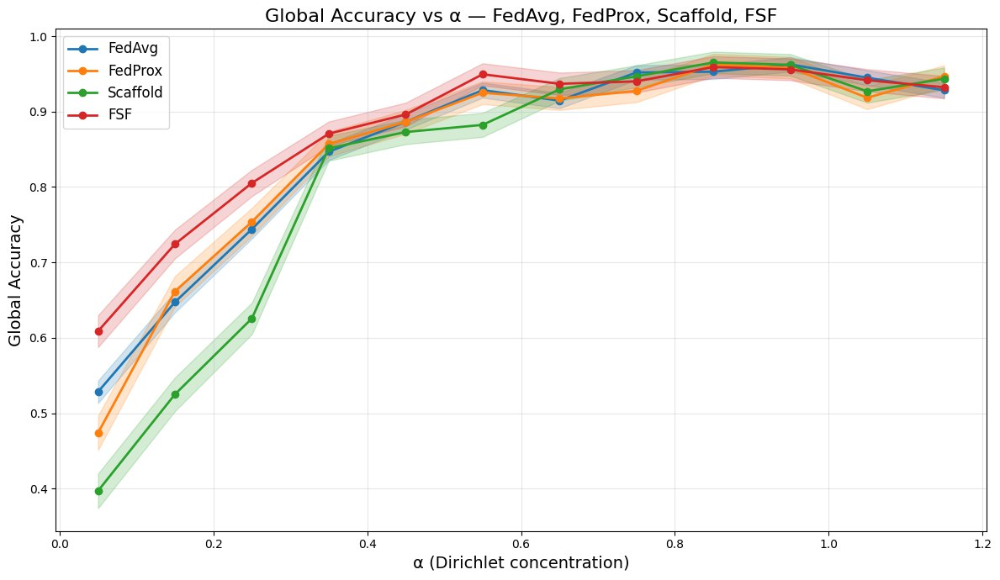
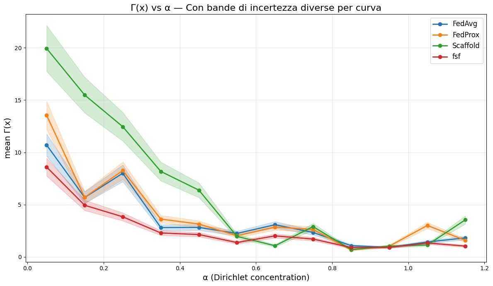

# FusedSpaceFed

**Enhanced Federated Learning Through Dual-Space Data Fusion**

> FusedSpaceFed mitigates client drift in non-IID federated settings by fusing original inputs with autoencoder-based reconstructions, aligning local gradients through a shared global decoder.

---

## Overview

Federated Learning on heterogeneous data suffers from **gradient dissimilarity**: when client distributions differ, local updates diverge from the global objective, slowing convergence. This problem is especially acute in medical imaging, where instrumental biases (different scanners, protocols, calibrations) introduce systematic site-specific shifts unrelated to the underlying pathology.

FusedSpaceFed addresses this at the **representation level** rather than purely at the optimizer level. Each client trains a private encoder $E_i$ that captures local data characteristics, while a globally aggregated decoder $D$ learns a federation-wide reconstructive consensus. The classifier receives the fused input $x + D(E_i(x))$, a partially calibrated signal that reduces gradient divergence across clients.

### Key ideas

- **Asymmetric aggregation**: encoders stay private; decoder and classifier are averaged across clients each round.
- **Encoder warm-up**: at the start of every round, each encoder is re-aligned to the frozen global decoder — a thermalization step that promotes a shared latent language.
- **Task-aware reconstruction**: classification gradients flow through $\tilde{x} = D(E_i(x))$ into the autoencoder, so the reconstruction is shaped by both pixel fidelity and discriminative utility.
- **Exact dissimilarity decomposition**: $\Gamma_{\text{fused}} = \Gamma_{\text{orig}} + R + \Phi$, where $\Phi < 0$ when reconstructions anti-correlate with gradient deviations — a verifiable *calibration condition* under which FusedSpaceFed provably improves over FedAvg.

## Architecture

```
Input x ──┬──────────────────────────┐
           │                          │  (identity)
           ▼                          │
      Encoder Eᵢ  (private)          │
           │                          │
           ▼                          │
      Decoder D   (global)           │
           │                          │
           ▼                          ▼
         x̃ = D(Eᵢ(x))       ──►   x + x̃   ──►  Classifier C (global)  ──►  ŷ
```

## Results

### Accuracy under strong non-IID conditions (Dirichlet α = 0.05)

| Dataset   | FedAvg | FedProx | SCAFFOLD | **FusedSpaceFed** |
|-----------|-------:|--------:|---------:|------------------:|
| Path      | 53.45  | 48.11   | 39.90    | **60.77**         |
| Chest     | 90.28  | 89.93   | 89.44    | **93.22**         |
| Derma     | 67.70  | 65.94   | 63.35    | **69.60**         |
| OCT       | 41.56  | 42.50   | 38.69    | **46.25**         |
| Pneumonia | 69.12  | 70.24   | 70.01    | **72.95**         |
| Retina    | 48.13  | 49.69   | 48.75    | **53.00**         |
| Breast    | 80.25  | 79.33   | 77.78    | **81.61**         |
| Blood     | 53.87  | 47.38   | 45.68    | **58.83**         |

### Pathological partitioning (2 classes per client)

| Dataset | FedAvg | FedProx | SCAFFOLD | **FusedSpaceFed** |
|---------|-------:|--------:|---------:|------------------:|
| Path    | 20.49  | 19.66   | 17.16    | **50.94**         |
| Derma   | 25.75  | 24.43   | 22.46    | **48.15**         |
| Retina  | 34.37  | 33.02   | 26.61    | **49.26**         |
| Blood   | 18.22  | 19.48   | 18.10    | **30.60**         |

### Stress test: accuracy vs. heterogeneity



### Gradient dissimilarity vs. heterogeneity



### FEMNIST

| Method            | Accuracy | Γ(x) | F1    | Balanced Acc. |
|-------------------|:--------:|:-----:|:-----:|:-------------:|
| FedAvg            | 85.49    | 0.83  | 66.87 | 67.09         |
| FedProx           | 84.73    | 0.81  | 64.16 | 65.81         |
| SCAFFOLD          | 84.51    | 0.78  | 65.68 | 66.46         |
| **FusedSpaceFed** | **86.82**| **0.71**| **68.77**| **68.38** |

## Reproduction

### Requirements

```
torch >= 2.0
torchvision
medmnist
numpy
```

### Training

```bash
# FusedSpaceFed on MedMNIST with Dirichlet α = 0.05
python train.py --method fusedspacefed --dataset pathmnist --alpha 0.05 \
    --clients 10 --rounds 50 --local_epochs 3 --dz 16 --lambda_rec 1.0

# Baselines
python train.py --method fedavg   --dataset pathmnist --alpha 0.05
python train.py --method fedprox  --dataset pathmnist --alpha 0.05
python train.py --method scaffold --dataset pathmnist --alpha 0.05
```

### Key hyperparameters

| Parameter | Description | Default |
|-----------|-------------|---------|
| `--dz`    | Latent bottleneck dimension | 16 |
| `--lambda_rec` | Reconstruction loss weight | 1.0 |
| `--warmup_epochs` | Encoder warm-up epochs per round | 1 |
| `--alpha` | Dirichlet concentration (lower = more non-IID) | 0.5 |
| `--clients` | Number of federated clients | 10 |
| `--rounds` | Communication rounds | 50 |

## Citation

```bibtex
@article{dicecco2025fusedspacefed,
  title     = {FusedSpaceFed: Enhanced Federated Learning Through Dual-Space Data Fusion},
  author    = {Di Cecco, Antonio and Metta, Carlo and Bianchi, Luigi Amedeo
               and Vegli{\'o}, Michelangelo and Parton, Maurizio},
  year      = {2025}
}
```

## License

TBD
