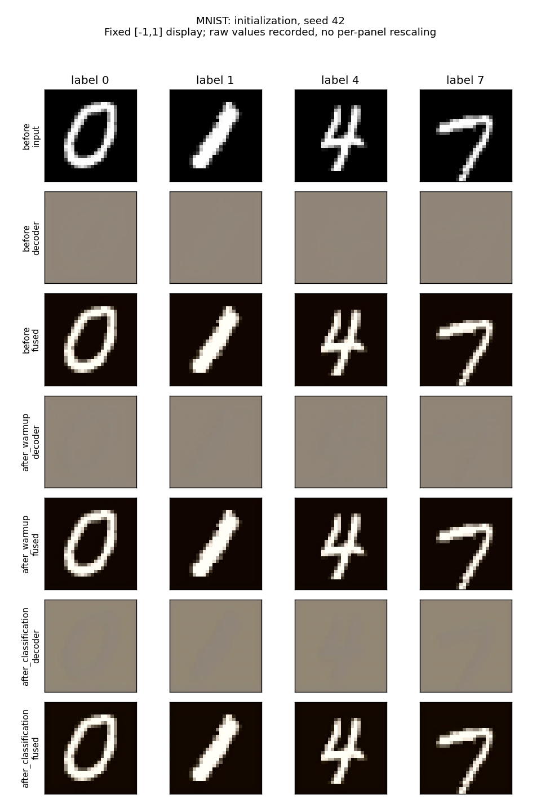
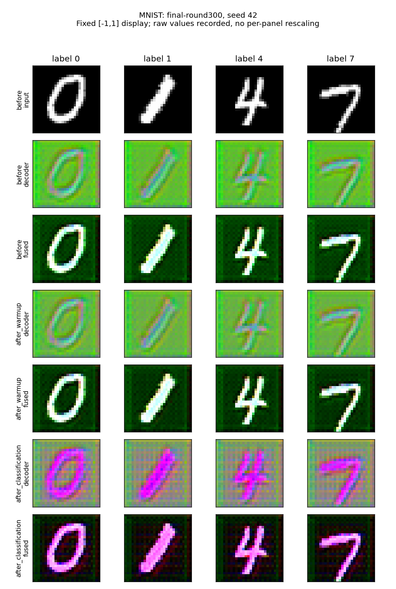
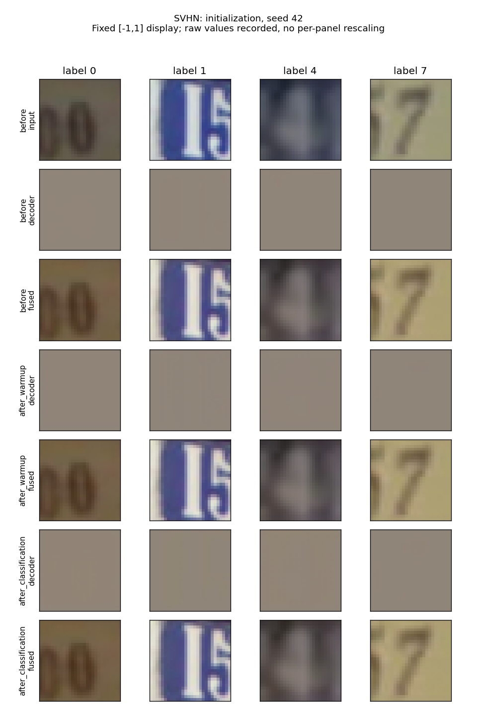
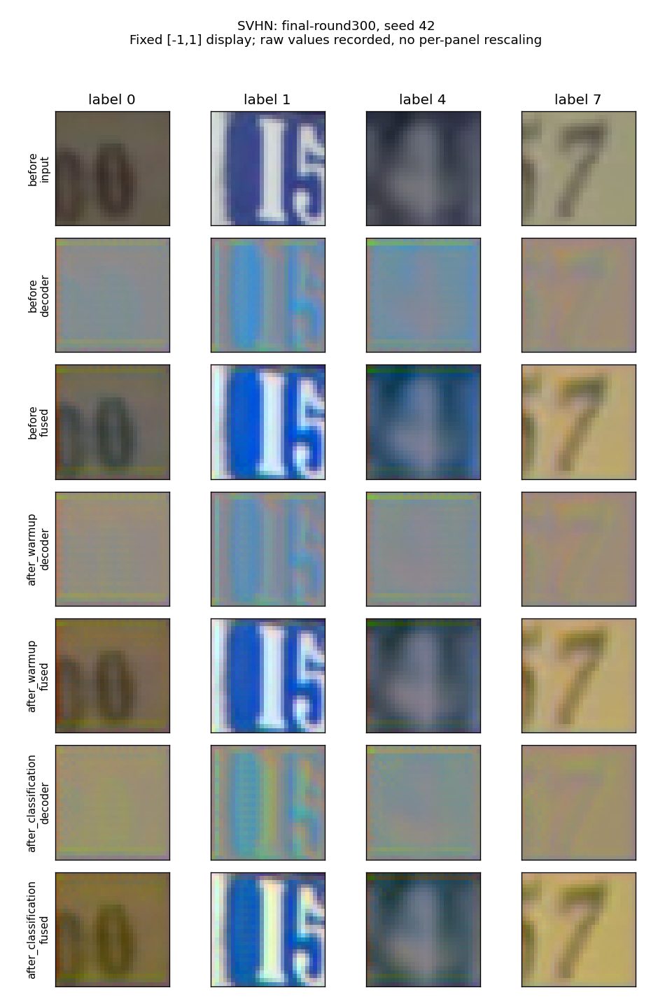
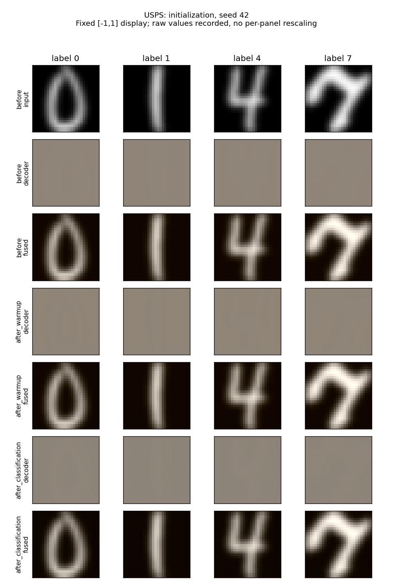
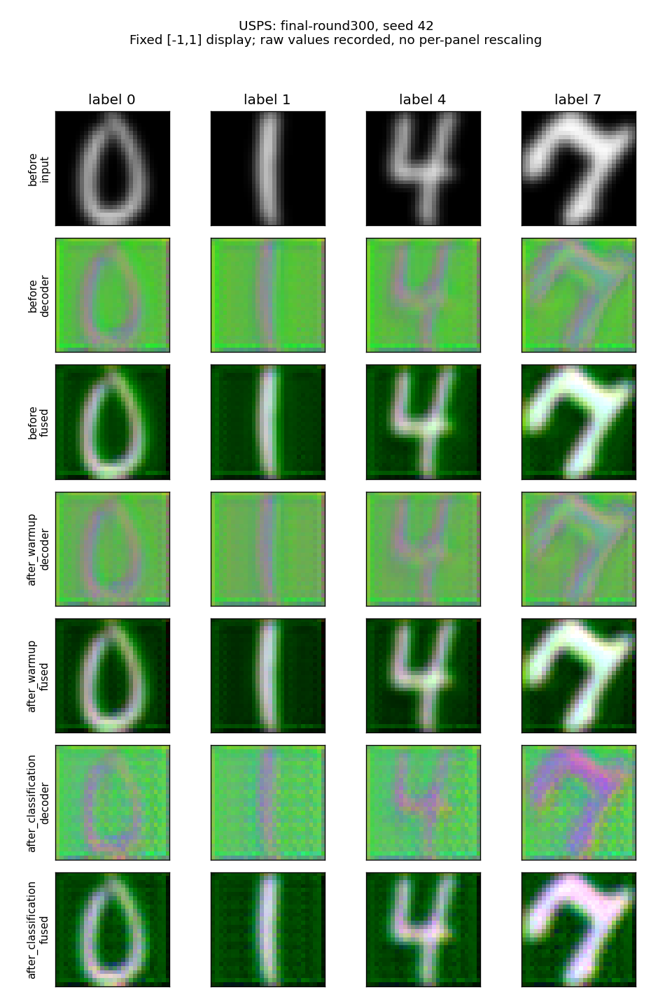
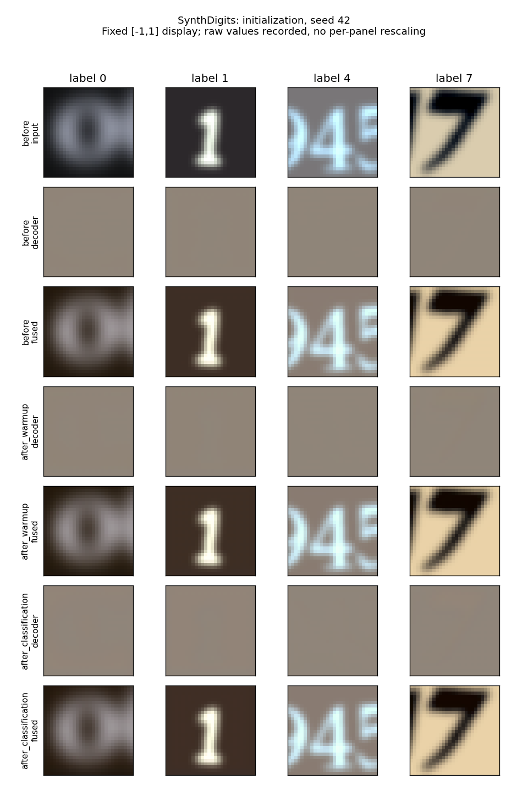
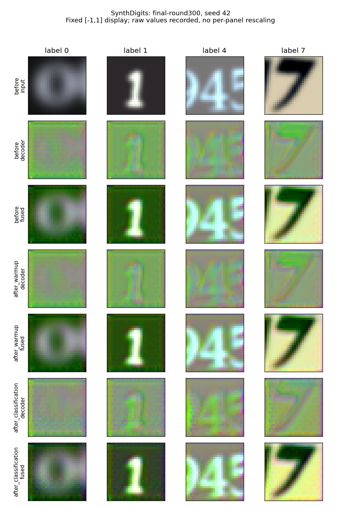
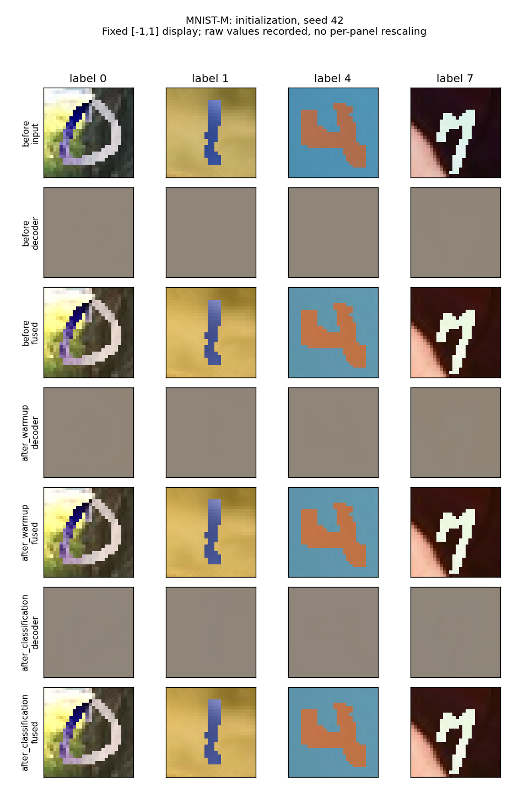
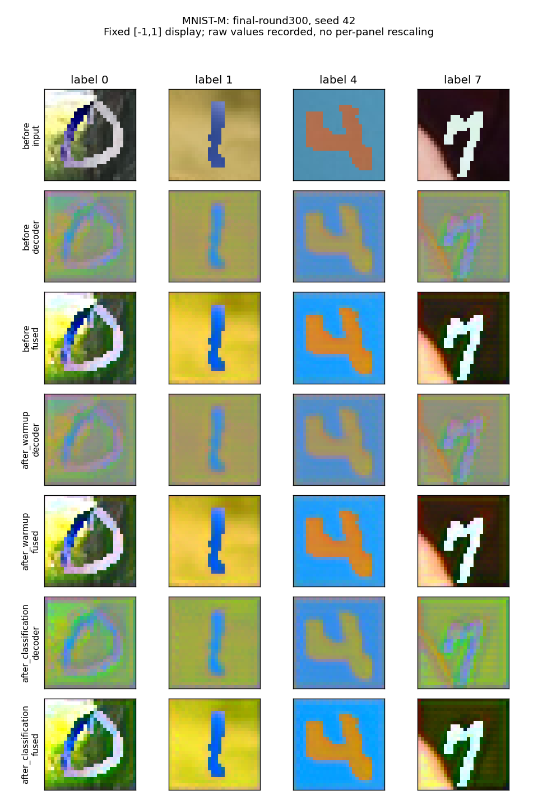

# Fase 1 — Decoder e warm-up su Digits

Cinque seed (42–46), due ancore: inizializzazione e checkpoint condiviso finale al round 300. Probe fisso di 160 esempi di training/client, 5 batch da 32, senza riuso e senza test. Ogni ancora viene copiata: una nuova partecipazione locale con warm-up 1 epoca (solo encoder) e classificazione 1 epoca (encoder/decoder/classifier). Gli stati intermedi sono replay diagnostici, non recupero degli stati storici del round 300. Optimizer resettati come nel protocollo esistente, Adam continuo tra le fasi.

Architettura e configurazione calibrata invariate: UNetSmallAE dz=64, DigitCNN, LR classifier 0,1 SGD, LR AE 0,0003 Adam, clip 10, Float32, batch 32. Parametri scelti precedentemente solo su validation; nessuna nuova selezione. Il decoder termina con Conv2d lineare senza sigmoid/tanh: ampiezze esterne a [-1,1] sono ammesse e misurate.

Medie su tutti i cinque seed. MSE, RMS e cross-entropy del probe sono calcolate in modalità eval con BN immutata. La sonda ripristina le modalità dei moduli e non consuma i generatori delle fasi di training. Valori per seed e SD campionarie (`ddof=1`) sono nel JSON, senza inferenze di significatività.

## initialization

| Dominio | MSE prima → warm → CE | RMS decoder/input prima → warm → CE | CE fusa prima → warm → CE |
|---|---:|---:|---:|
| MNIST | 0.942798 → 0.921334 → 0.923928 | 0.121950 → 0.121462 → 0.126017 | 2.302218 → 2.302215 → 0.735502 |
| SVHN | 0.196485 → 0.192105 → 0.192402 | 0.274963 → 0.272730 → 0.280306 | 2.302991 → 2.302995 → 2.745840 |
| USPS | 0.594604 → 0.580395 → 0.581312 | 0.154175 → 0.153745 → 0.149431 | 2.304013 → 2.304009 → 0.657415 |
| SynthDigits | 0.373028 → 0.365560 → 0.367001 | 0.196111 → 0.195020 → 0.194242 | 2.303213 → 2.303211 → 1.508413 |
| MNIST-M | 0.284539 → 0.279462 → 0.277226 | 0.227797 → 0.225768 → 0.221182 | 2.301640 → 2.301641 → 1.789667 |

Variazione media MSE warm−prima: -0.010520; CE−warm: +0.000603. Sono variazioni locali del probe, non accuratezze di generalizzazione.

## final-round300

| Dominio | MSE prima → warm → CE | RMS decoder/input prima → warm → CE | CE fusa prima → warm → CE |
|---|---:|---:|---:|
| MNIST | 0.902273 → 0.896192 → 1.116350 | 0.274298 → 0.245749 → 0.396622 | 0.000366 → 0.000370 → 0.000047 |
| SVHN | 0.187707 → 0.185307 → 0.195541 | 0.275508 → 0.257068 → 0.337984 | 0.124881 → 0.123661 → 0.011481 |
| USPS | 0.564878 → 0.561068 → 0.571527 | 0.309895 → 0.281745 → 0.388452 | 0.000210 → 0.000223 → 0.000033 |
| SynthDigits | 0.351707 → 0.348212 → 0.366778 | 0.343340 → 0.329228 → 0.375949 | 0.000640 → 0.000531 → 0.237094 |
| MNIST-M | 0.249643 → 0.247537 → 0.263896 | 0.322287 → 0.330111 → 0.434079 | 0.001089 → 0.001110 → 0.000076 |

Variazione media MSE warm−prima: -0.003578; CE−warm: +0.055155. Sono variazioni locali del probe, non accuratezze di generalizzazione.

## Stabilità e interpretazione

Tutti gli output, loss, norme e stati sono finiti. Il warm-up lascia decoder e classifier identici bit per bit; aggiorna l’encoder. La classificazione aggiorna tutti e tre i componenti. Le variazioni L2 degli stati includono eventuali buffer BN, non sono sole norme dei parametri; le norme effettive dei gradienti e gli interventi di clipping sono registrati separatamente. Nessuna variazione del metodo è stata introdotta.

L’obiettivo di ricostruzione agisce solo nel warm-up, con decoder congelato; la fase CE non garantisce ricostruzioni fedeli. La misura di ampiezza/coseno/MSE deve quindi distinguere ricostruzione da correzione utile al classificatore. Le sonde non provano un effetto causale del warm-up sulla performance finale: lo misurerà l’ablation riaddestrata della fase 2.

Le griglie del checkpoint finale mostrano anche trasformazioni di colore e struttura spaziale nell’output del decoder: va interpretato come segnale appreso insieme al classificatore, non automaticamente come una copia visivamente fedele dell’immagine. Il caso visuale seed 42 è esemplificativo; statistiche su tutti i seed rimangono l’evidenza quantitativa.

## Esempi visivi

Seed 42 predefinito; quattro classi fissate (0,1,4,7) per dominio, primo esempio disponibile nella sonda. Ogni griglia mostra input, decoder e input+decoder prima/dopo warm-up e CE. Scala visuale fissa [-1,1], clipping soltanto nella resa grafica; nessun riscalamento individuale. Gli output grezzi non vengono tagliati nel training o nelle misure. Un’immagine non rappresenta la distribuzione complessiva: i 160 esempi e tutti i seed determinano le statistiche.

### MNIST





### SVHN





### USPS





### SynthDigits





### MNIST-M





## Costi, archivio e riproduzione

Calendario fase: 54.232 s; somma processi: 97.240 s. Un worker/GPU, entrambe usate, nessun processo preesistente interrotto. Cinque checkpoint originali riusati; sonde, stati per fase, RNG e checkpoint delle ancore conservati in `_local/digits_mechanism_diagnostics/phase1/`, con hash e dimensioni in summary.json.

| Seed | Durata worker (s) | CUDA alloc/res (MiB) | RSS (MiB) |
|---:|---:|---:|---:|
| 42 | 20.227 | 275.292/352.000 | 2065.328 |
| 43 | 13.940 | 275.292/352.000 | 2003.309 |
| 44 | 11.925 | 275.292/352.000 | 2007.258 |
| 45 | 12.859 | 275.292/352.000 | 2003.676 |
| 46 | 10.375 | 275.292/352.000 | 2004.520 |

Comandi effettivi, PID, exit code e assegnazioni GPU in `artifacts/campaign.json`; configurazione e sonda congelate in config.json e ../probe.json. Per riprodurre, usare una nuova directory di output:

```bash
/home/schroeder/miniconda3/envs/general_ml/bin/python research/digits_mechanism_diagnostics/phase1/diagnose.py --seed 42 --device cuda:1 --output _local/digits_mechanism_diagnostics/phase1/reproduction-seed-42
python research/digits_mechanism_diagnostics/phase1/archive.py verify
```

Test sintetici: metriche/range/nonfinite; hash e distanze degli stati; sonde senza mutazione di stati/RNG/BN/modi; flusso dei gradienti delle due fasi. Suite versionata completa e log allegati. Manoscritto e vecchi esperimenti invariati.

Limiti: due stati e un singolo passo locale di replay, sonda train-only fissata e una partizione; il checkpoint finale ha già visto questi esempi. Non si estrapola una traiettoria di ricostruzione per tutti i 300 round, non si selezionano iperparametri da queste figure e non si identifica ancora una causa del vantaggio.
