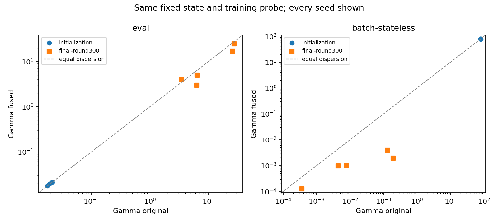

# Fase 3 — Diagnostica dei gradienti su Digits

Cinque seed 42–46, stati iniziali e finali al round 300 riusati dalla fase 1. Stessa sonda train-only: 160 esempi/client in 5 batch da 32, stessi input/label per originale e fuso. Parametri classifier θ, decoder φ ed encoder privato ψᵢ sono identici nei due percorsi. Nessun optimizer step, adattamento, accesso al test o selezione di iperparametri.

Per ogni client si media il gradiente delle cinque loss CE medie per batch (tutti della stessa dimensione), poi si calcola la dispersione dei cinque gradienti medi dei client. Si conservano anche i risultati per batch; **la media delle dispersioni per batch non viene sostituita alla dispersione dei gradienti medi**. Gradients e modello Float32; accumulo e riduzioni CPU Float64.

Definizioni del manoscritto, paper/aistats_2027.tex, sezione Exact Fixed-Round Decomposition: gᵒᵢ=∂θℓ(Cθ(x),y); gᶠᵢ=∂θℓ(Cθ(x+Dφ(Eψᵢ(x))),y); bᵢ=gᶠᵢ−gᵒᵢ. Γᵒ/f=(1/5)Σ||gᵒ/fᵢ−mean(gᵒ/f)||²; B=(1/5)Σ||bᵢ−mean(b)||²; Φ=(2/5)Σ〈gᵒᵢ−mean(gᵒ), bᵢ−mean(b)〉. Γ fusa=Γ originale+B+Φ. Il divisore della dispersione è m=5; la SD tra seed usa ddof=1.

Due modalità predefinite: `eval` con statistiche BN globali congelate (principale); `batch-stateless` con statistiche del batch e buffer ripristinati prima/dopo ogni ramo. In quest’ultima modalità l’obiettivo è condizionato ai batch perché BN accoppia i campioni. Tutti i valori dei parametri e dei buffer rimangono uguali; nessuna ricalibrazione delle statistiche. La sensibilità BN distingue allineamento all’inferenza da comportamento del gradiente nella modalità di training.

## initialization — eval

| Seed | Γ originale | Γ fusa | B | Φ | Γf/Γo | Γ decoder |
|---:|---:|---:|---:|---:|---:|---:|
| 42 | 2.13317097e-02 | 2.11873548e-02 | 6.51007495e-04 | -7.95362398e-04 | 0.993233 | 1.94482950e-07 |
| 43 | 2.07878684e-02 | 2.07519699e-02 | 1.51959707e-03 | -1.55549550e-03 | 0.998273 | 4.27030461e-07 |
| 44 | 2.10397862e-02 | 2.11664061e-02 | 2.90095031e-04 | -1.63475115e-04 | 1.006018 | 4.69694009e-07 |
| 45 | 1.77915601e-02 | 1.78867992e-02 | 1.40208471e-03 | -1.30684561e-03 | 1.005353 | 3.94147459e-07 |
| 46 | 1.90912763e-02 | 1.96260516e-02 | 1.40525953e-03 | -8.70484241e-04 | 1.028011 | 7.02358551e-07 |

Riduzione in 2/5 seed. Rapporto Γf/Γo medio ± SD: 1.006178 ± 0.013299.
Dispersione normalizzata Γ/mean(||gᵢ||²), originale → fusa: 0.798857 → 0.798798. Coseno medio tra coppie di client: -0.004774 → -0.004860.

## initialization — batch-stateless

| Seed | Γ originale | Γ fusa | B | Φ | Γf/Γo | Γ decoder |
|---:|---:|---:|---:|---:|---:|---:|
| 42 | 7.95770071e+01 | 7.91037141e+01 | 8.32661594e+00 | -8.79990892e+00 | 0.994052 | 2.00258812e-03 |
| 43 | 7.89734373e+01 | 7.93593652e+01 | 1.39168409e+01 | -1.35309130e+01 | 1.004887 | 1.89136587e-03 |
| 44 | 7.78467947e+01 | 7.78489986e+01 | 3.41924582e+00 | -3.41704184e+00 | 1.000028 | 1.58846882e-03 |
| 45 | 7.88496281e+01 | 7.85084533e+01 | 1.33271643e+01 | -1.36683391e+01 | 0.995673 | 2.30736708e-03 |
| 46 | 7.80388415e+01 | 7.77512551e+01 | 1.37633505e+01 | -1.40509369e+01 | 0.996315 | 2.23678292e-03 |

Riduzione in 3/5 seed. Rapporto Γf/Γo medio ± SD: 0.998191 ± 0.004336.
Dispersione normalizzata Γ/mean(||gᵢ||²), originale → fusa: 0.736350 → 0.737026. Coseno medio tra coppie di client: 0.077511 → 0.076279.

## final-round300 — eval

| Seed | Γ originale | Γ fusa | B | Φ | Γf/Γo | Γ decoder |
|---:|---:|---:|---:|---:|---:|---:|
| 42 | 2.74937890e+01 | 2.43937748e+01 | 1.93702334e+00 | -5.03703751e+00 | 0.887247 | 9.86956908e+00 |
| 43 | 6.37400953e+00 | 4.97937165e+00 | 1.17240218e+00 | -2.56704007e+00 | 0.781199 | 9.38066033e+00 |
| 44 | 2.57208564e+01 | 1.70747558e+01 | 1.86350588e+00 | -1.05096065e+01 | 0.663849 | 1.90886664e+00 |
| 45 | 6.26257473e+00 | 2.96597744e+00 | 1.04865665e+00 | -4.34525393e+00 | 0.473604 | 1.68494298e+00 |
| 46 | 3.44620648e+00 | 3.97134860e+00 | 4.53907464e-01 | 7.12346572e-02 | 1.152383 | 1.05937361e+01 |

Riduzione in 4/5 seed. Rapporto Γf/Γo medio ± SD: 0.791656 ± 0.253408.
Dispersione normalizzata Γ/mean(||gᵢ||²), originale → fusa: 0.794160 → 0.799588. Coseno medio tra coppie di client: 0.090559 → 0.043966.

## final-round300 — batch-stateless

| Seed | Γ originale | Γ fusa | B | Φ | Γf/Γo | Γ decoder |
|---:|---:|---:|---:|---:|---:|---:|
| 42 | 1.92972858e-01 | 1.93226105e-03 | 1.71668429e-01 | -3.62709027e-01 | 0.010013 | 7.97695942e-04 |
| 43 | 7.76417299e-03 | 9.96296354e-04 | 5.28264835e-03 | -1.20505250e-02 | 0.128320 | 6.84267572e-04 |
| 44 | 4.34338864e-03 | 9.85846306e-04 | 2.81431982e-03 | -6.17186216e-03 | 0.226976 | 1.67285046e-03 |
| 45 | 3.66525648e-04 | 1.27224240e-04 | 2.89110159e-04 | -5.28411567e-04 | 0.347109 | 3.96342165e-06 |
| 46 | 1.31176132e-01 | 3.85867786e-03 | 1.04926089e-01 | -2.32243543e-01 | 0.029416 | 1.36803481e-03 |

Riduzione in 5/5 seed. Rapporto Γf/Γo medio ± SD: 0.148367 ± 0.140864.
Dispersione normalizzata Γ/mean(||gᵢ||²), originale → fusa: 0.796595 → 0.789012. Coseno medio tra coppie di client: 0.021850 → 0.023454.

## Interpretazione, scale e decoder

Identità verificata anche ricostruendo Γ/B/Φ dai Gram salvati, per 20 casi medi e 100 casi per batch. Residuo relativo massimo dei casi medi: 1.684e-15. B è non negativo; la riduzione richiede B+Φ<0, non soltanto Φ<0.

Si riportano norme dei gradienti medi per client, norma del gradiente medio globale, energie, coseni e dispersione normalizzata per evitare di leggere un semplice calo di scala del gradiente come maggiore allineamento direzionale. Le norme per batch includono classifier originale/fuso, encoder, decoder e gruppo AE congiunto. Sono gradienti grezzi, prima del clipping; non coincidono con gli aggiornamenti Adam/SGD applicati durante il training.

Al finale, in modalità eval la dispersione normalizzata aumenta da 0,794160 a 0,799588 e il coseno medio diminuisce da 0,090559 a 0,043966: la riduzione di Γ assoluta non è accompagnata da migliore allineamento direzionale. In batch-stateless la normalizzazione cambia poco (0,796595 → 0,789012) e il coseno passa da 0,021850 a 0,023454, nonostante un forte calo di Γ grezza. I risultati indicano soprattutto una diversa scala dei gradienti e sensibilità alla BN; non sostengono un miglioramento direzionale ampio o universale.

Per il decoder si misura hᵢ=∂φℓ(Cθ(x+Dφ(Eψᵢ(x))),y) al medesimo φ condiviso, mediando prima i cinque batch. ΓD=(1/5)Σ||hᵢ−mean(h)||², norme, normalizzazione e Gram sono salvati. È uno spazio distinto, di 44.995 parametri, rispetto ai 14.219.210 del classifier: i due valori grezzi non vanno confrontati come se avessero la stessa dimensione. Il ramo originale non dipende da φ; non se ne inventa una baseline utile di dispersione decoder.



## Limiti e collegamento alle ablation

È una diagnosi condizionata allo stesso stato Fused già allenato: il classifier è stato ottimizzato sull’input fuso, quindi il ramo originale è controfattuale e può avere loss o scala dei gradienti maggiori. La BN eval riflette statistiche apprese su input fusi; la sensibilità batch-stateless espone questo possibile effetto. Le metriche normalizzate e i coseni non sostituiscono Γ ma ne delimitano l’interpretazione. Una riduzione non prova causalità dell’accuratezza, minore drift lungo tutti i round o una garanzia di convergenza.

La sonda ha visto training, conserva le proporzioni di classe diverse tra domini e non è un campione di test: la dispersione include anche label-mix, non solo feature shift. Cinque batch riducono il rumore rispetto a uno ma non recuperano l’aspettativa della distribuzione intera. Due stati, una partizione e cinque seed; nessuna estrapolazione alle partizioni label-skew del manoscritto.

La fase 2 mostra encoder condiviso 86,178544 ± 0,468069%, full 85,862359 ± 0,846930%, no warm-up 85,714598 ± 0,789950%, decoder-only 84,859627 ± 0,580810%. Qui la persistenza privata non è sostenuta come necessaria, il warm-up ha piccolo effetto medio e maggiore costo, mentre l’aggiunta dell’input migliora in media il solo decoder. Le eccezioni per seed/dominio restano nel report della fase 2; Γ non annulla quei limiti.

## Archivio, costi e verifiche

Calendario: 84.246 s; somma processi: 392.701 s. Cinque valutazioni indipendenti in parallelo, 3 su GPU 1 e 2 su GPU 0, nessun processo esterno interrotto. Tutti gli exit code sono 0.

| Seed | Durata worker (s) | CUDA alloc/res (MiB) | RSS (MiB) |
|---:|---:|---:|---:|
| 42 | 72.331 | 229.996/264.000 | 3016.793 |
| 43 | 76.585 | 229.996/264.000 | 3020.055 |
| 44 | 72.711 | 229.996/264.000 | 3020.410 |
| 45 | 70.409 | 229.996/264.000 | 3019.117 |
| 46 | 68.395 | 229.996/264.000 | 3017.336 |

Risultati per seed e batch, Gram sufficienti a ricostruire la decomposizione, norme/loss e medie/SD sono in artifacts/. Config, source hash, checkpoint hash e sonda fissati; ancore complete e RNG riusati da `_local/digits_mechanism_diagnostics/phase1/`, risultati/log completi in `_local/digits_mechanism_diagnostics/phase3/`. Dataset e pesi non vengono versionati. Nessuna modifica al manoscritto.

302 test versionati passati (`pytest -q tests research`, 78,61 s). Algebra esatta e fattore 2 del termine Φ; peso dei batch; indipendenza dai chunk; valori non finiti; parametri/buffer/RNG immutati in entrambe le modalità BN, nessuna .grad o optimizer step. Log allegato. Audit indipendente dei Gram e dell’identità in tutti i casi, sorgenti e completezza.

```bash
/home/schroeder/miniconda3/envs/general_ml/bin/python research/digits_mechanism_diagnostics/phase3/probe_gradients.py --seed 42 --device cuda:1 --output _local/digits_mechanism_diagnostics/phase3/reproduction-seed-42
python research/digits_mechanism_diagnostics/phase3/archive.py verify
```
